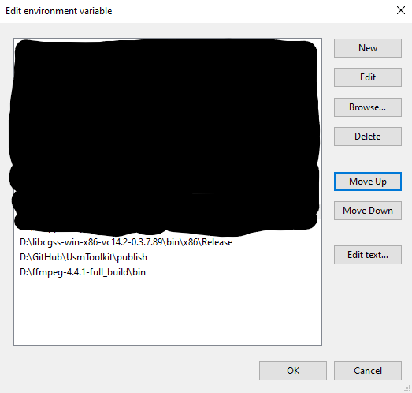

# Priconne Utils

Scripts written in Python to get the master.db, BGM files, L2D, UB Cutin, etc. from the game Princess Connect! Re: Dive JP Server. Made in Windows 10, so it might not work as intended on other OSs.

## Requirements

- Internet Connection (obviously)
- [Python 3.x](https://www.python.org/downloads/)
- Requests library for Python `pip install requests`
- [UsmToolkit (for video files)](https://github.com/MightyZanark/UsmToolkit)
- [FFmpeg (for audio files and UsmToolkit)](https://ffmpeg.org/download.html)
- [.NET 3.1 Core Runtime (for UsmToolkit)](https://dotnet.microsoft.com/en-us/download/dotnet/3.1/runtime)

Note: If you don't already have FFmpeg installed, then you can just do it from UsmToolkit. UsmToolkit have a command to download FFmpeg.

## How to Use

1. Well first of all, install all the requirements, won't work without it.
2. If you haven't already, add Python, UsmToolkit, and FFmpeg to PATH in System Variables. If you don't know how to do that then check out the later section. Additionally, if you got FFmpeg from UsmToolkit, then as long as UsmToolkit is in PATH, you are good to go.
3. If you got everything set up already, then you can double click on `Run.py` to run the script. After running, a window will pop up and there are instructions there as well.
4. 

## How to Add to PATH (Windows 10)

1. Open up the search bar and search for `system variables`, `Edit the system environment variables` should appear so click on it.
2. A window called `System Properties` should open and you should be in the `Advanced` tab.
3. At the very bottom, there should be a button called `Environment Variables...`, click that.
4. Another window called `Environment Variables` should open up. There are 2 section in it, the upper part is the variables for the **CURRENT USER**, while the bottom part is for the **WHOLE SYSTEM** (or ALL USER). You can choose whether you like Python, UsmToolkit, and FFmpeg to be available to only the **CURRENT USER** or to **ALL USER**.
5. After you decided which one you want to edit, find the variable called `Path` (not `PATHEXT`), select it, and press `Edit` or double click it. That should open up yet another window.
6. In that window, there should be all kinds of options like `New`, `Edit`, `Browse`, `Delete`, etc. To add Python and UsmToolkit to it, press `New`.
7. Copy and paste the full path of Python and UsmToolkit, and by full path I meant something like this `C:\Users\user\AppData\Local\Programs\Python\Python39\`. At the end of it, you should have something along this line  I have FFmpeg as a separate line because I already have FFmpeg installed way before I have UsmToolkit, but if you don't have both and you downloaded FFmpeg from UsmToolkit command, then you just need to have UsmToolkit in `Path` and it will work just fine.

If this still wasn't clear, you can contact me through Discord from [Priconne Unofficial Server](https://discord.gg/priconne), if you're not from the server, chances are I will just ignore your DM/friend req. My tag is **MightyZanark#0138**.